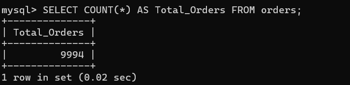
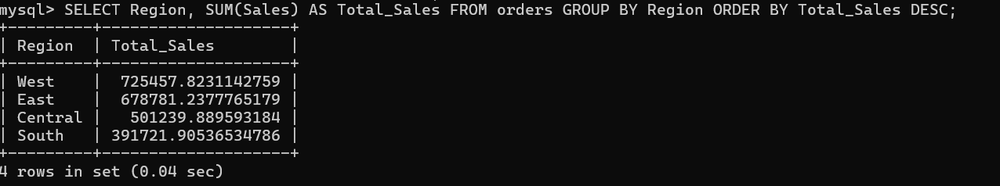
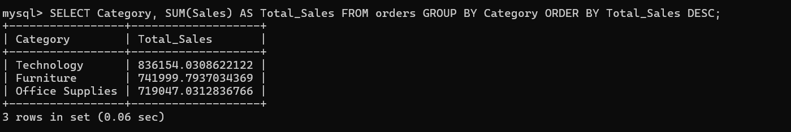
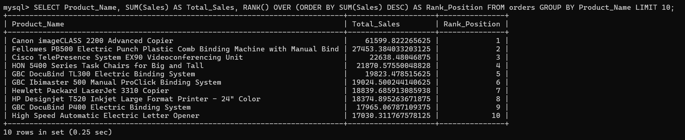
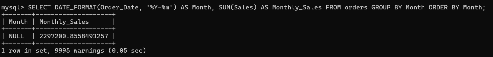

# Retail Sales Analysis Dashboard (Power BI)

## Overview
This project focuses on analyzing retail sales data using Power BI to uncover key business insights.  
The dashboard provides a clear view of sales performance, profit trends, and the impact of discounts on profitability.

##  Objectives
- Analyze sales performance across different product categories  
- Identify trends in profit over time  
- Understand the relationship between discount and profit  
- Provide insights to support business decision-making  

## Tools & Technologies
- Power BI  
- Python (for data understanding)  
- SQL (for data querying)  
- Excel / CSV dataset  

## Dashboard Features
- **Sales by Category** – Comparison of sales across product categories  
- **Profit Trend Over Time** – Year-wise profit growth analysis  
- **Discount vs Profit Analysis** – Scatter plot showing relationship between discount and profit  
- **KPI Cards** – Total Sales and Total Profit  
- **Interactive Filters** – Category-based filtering  

## Key Insights
- Technology category has the highest sales among all categories  
- Profit shows a steady growth over time  
- Higher discounts tend to reduce profit, indicating a negative relationship  

## SQL Analysis
### Total Sales

### Total orders

### Total 10 products

### Sales by Region

### Sales by Category

### Rank products by sales

### Monthly Sales Trend

### Dashboard

## Conclusion
This project demonstrates how data visualization can be used to extract meaningful insights and support business decisions.
