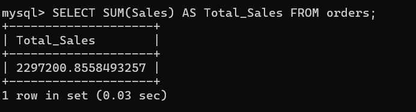

# retail-sales-analysis

## Project Overview
This project analyzes retail sales data to identify trends and generate business insights.

## Dataset
- Source (Superstore dataset)
- Rows: 9994
- Columns: 21 

## Tools Used
- Python
- Pandas
- Matplotlib
- SQL queries ((MySQL)
- Power BI dashboard

## Dataset
Retail sales dataset containing information about orders, products, sales, and regions.

## Analysis Performed
- Sales by Product Category
- Monthly Sales Trend
- Regional Sales Performance
- Top 10 Products by Revenue

## Key Insights
- Technology category generates the highest revenue.
- Certain months show higher sales indicating seasonal demand.
- A few products contribute a large portion of total sales.

## 📊 SQL Analysis
### 🏆Total Sales

## Repository Structure
data/ → dataset used for analysis  
retail_sales_analysis.ipynb → Python analysis notebook
